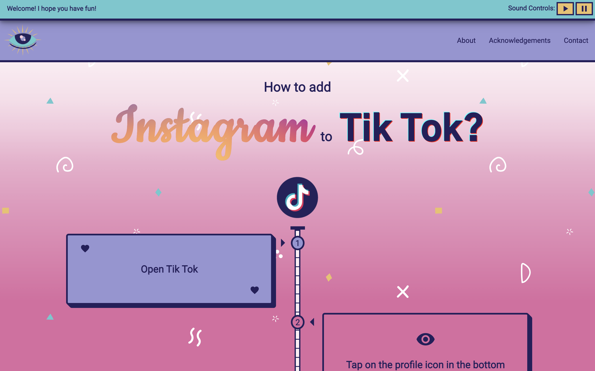
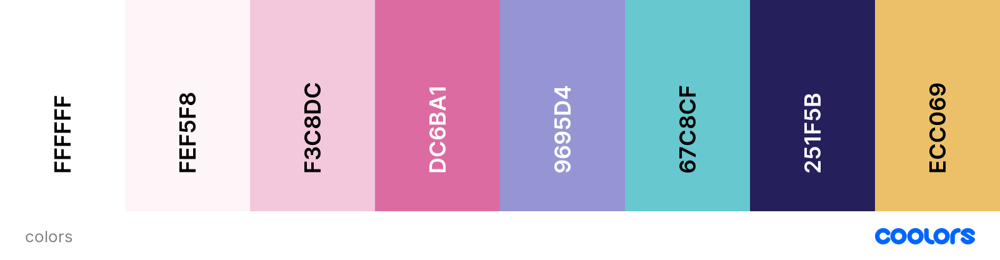
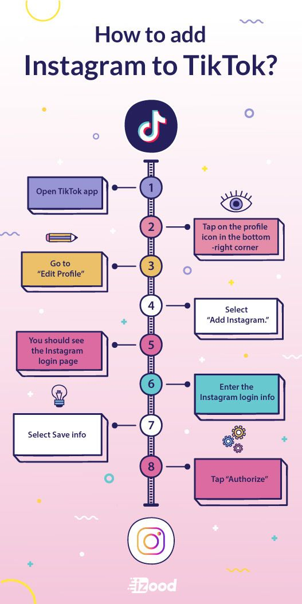

# _Vertical: A Timeline_

#### By _**Chloe Loveall**_
<br>

 &nbsp;  &nbsp;  &nbsp;  &nbsp;  &nbsp;  &nbsp; 

## Table of Contents

1. [Table of Contents](#table-of-contents)
2. [Description](#description)
3. [Preview](#preview)
4. [Technologies Used](#technologies-used)
5. [Setup and Installation Requirements](#setup-and-installation-requirements)
    * [Prior to Installation](#prior-to-installation)
      * [Git Installation](#confirm-you-have-git-installed)
    * [Installation](#installation)
      * [Clone](#clone)
      * [Download](#download)
6. [Known Bugs](#known-bugs)
7. [Issues](#issues)
8. [Contributing](#contributing)
9. [License](#license)
10. [Acknowledgements](#acknowledgements)
11. [Contact Information](#contact-information)

## Description

Days four, five, six, and seven of #100daysofcode. I intended for this to be a one day project, but once I started playing around with things I was having too much fun to quit! (Plus getting ready for my internship means less time for solo projects). Initially, I just wanted to build a vertical timeline and to challenge myself to build a project based on something that I didn't design. I found an image on [Pinterest](https://www.pinterest.com/pin/856669160361640181/) to use as my mockup/inspiration. 

The project is a responsive, mobile-friendly vertical timeline with sound effects, custom cursors, and animations. The site is meant to be very whimsical and playful - I hope you'll check it out with your sound on! :heartpulse: :purple_heart: :yellow_heart: :blue_heart:

## Preview

Live preview: [Vertical](https://vertical.vercel.app/)

Deployed on [Vercel](https://vercel.com)

## Technologies Used

* CSS
* HTML
* JavaScript

## Design

|                                               |                                                 |
| --------------------------------------------- | ----------------------------------------------- |
| **Color Palette**                             | **Logo Samples**                                |
|        |     |
| **Design Inspo Image**                        | **Design Samples**                              |
|  | |


## Setup and Installation Requirements

### Prior to Installation

#### Confirm you have Git installed

  * Installing Git on Macs:
    * Install the package manager [Homebrew](https://brew.sh/) by copying and pasting the following in the terminal: ```$ /usr/bin/ruby -e "$(curl -fsSL https://raw.githubusercontent.com/Homebrew/install/master/install)"```
    * Copy and paste once of the following lines in the terminal so that Homebrew packages are run before the system versions of the same packages:
      * For bash users: ```$ echo 'export PATH=/usr/local/bin:$PATH' >> ~/.bash_profile```
      * For zsh users: ```$ echo 'export PATH=/usr/local/bin:$PATH' >> ~/.zshrc```
    * Last, install Git with the following terminal command: ```$ brew install git```

  * Installing Git on Windows:
    * Open Command Prompt, the Windows terminal program. You can access it by typing ```Cmd``` in the search bar in the bottom left corner.
    * **NOTE** There are many options available, but we recommend using a free program called [Git Bash](https://gitforwindows.org/)
    * Navigate to [Git Bash](https://gitforwindows.org/) and click on the Download button. This will take you to a page with the latest version of Git Bash. Determine whether you have 32-bit or 64-bit Windows by following these instructions. Then download the corresponding exe file from the Git for Windows site. (If you have a package manager already installed, you can also choose to download the tar.bz2 version.)
    * Click on the downloaded file and then follow the instructions in the Setup menu until you reach the Install button and install the package.

### Installation

#### Clone

* Clone the repository with the following git terminal command: ```$ git clone https://github.com/chloeloveall/vertical.git```
* Open the project's root directory (```vertical```) in your terminal

#### Download

* Open the repository on GitHub: [chloeloveall/vertical](https://github.com/chloeloveall/vertical/)
* Click ```Code``` button and select ```Download ZIP```
* Open and extract the files
* Open [VSCode], or your code editor of choice
* Select ```File>Open...``` and navigate to the unzipped file folder 
* Select ```vertical``` and click ```open``` to view the project

## Known Bugs

* None at this time

## Issues

* Report issues [here](https://github.com/chloeloveall/vertical/issues) and select the ```New issue``` button for support

## Contributing

Contributions are what make the open source community such an amazing place to be learn, inspire, and create. Any contributions you make are greatly appreciated.

1. Fork the project on GirHub
    * Follow [Installation and Setup Requirements](#setup-and-installation-requirements) above
2. Create your Feature Branch: ```$ git checkout -b YourFeatureBranchName```
3. Commit your Changes ```$ git commit -m 'Add some Amazing Feature'```
4. Push to your feature branch on Github ```$ git push origin YourFeatureBranchName```
5. Open a Pull Request

## License

[GNU GPLv3](LICENSE.txt)

## Acknowledgements

* [Choose an open source license](https://choosealicense.com/)
* [Coolors.co](https://coolors.co/)
* [CSS Gradient](https://cssgradient.io/)
* [Font Awesome](https://fontawesome.com/)
* [Google Fonts](https://fonts.google.com/)
* [Hero Patterns](http://www.heropatterns.com/)
* [Shields](https://shields.io/)
* [SVG Backgrounds](https://www.svgbackgrounds.com/#confetti-doodles/)
* [Tik Tok Animation](https://codepen.io/JohannesKantz/pen/YzqXpRR/)
* [Vercel](https://vercel.com/)

## Contact Information

_Chloe Loveall <chloeloveall@protonmail.com>_

 &nbsp;  &nbsp; 

[Back to Top](#table-of-contents)